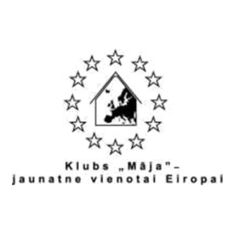

	

<h1 class="mvl">Wololooo!</h1>

  

  

  

		

	

 

	

		
We are group of young people from Latvia, Lithuania, Estonia and Belarus, who traveled to Latvian borderline to discover its hiddren treasures and secrets and understand what stand behind idea of a border - how it affects people who live at the border? How the borderline with sea is different from the borderline with other countries? How cities and people differ from big cities and their citizens? This webpage is dedication for our travels.

	

	

		

		<ul class="no-list">
		    <li><a href="#"><i class="fa fa-cubes"></i>boring nr.1</a></li>
		    <li><a href="#"><i class="fa fa-bed"></i>Yawn</a></li>
		    <li><a href="#"><i class="fa fa-user"></i>you get the idea</a></li>
		</ul>
	

		<ul class="small-block-grid-3">
			<li></li>
			<li></li>
			<li></li>
		</ul>
		<ul class="small-block-grid-2">
       
        
			<li></li>
			<li></li>
		</ul>

	

    
    

	
This project has been funded with support from the European Commission. This publication reflects the views only of the author, and the Commission cannot be held responsible for any use which may be made of the information contained therein.

	
<!--		
And out of the box, this supports <a href="http://fortawesome.github.io/Font-Awesome/">
		<i class="fa fa-flag fa-lg">	
		</i>
		font awesome</a>, so you can go crazy with <a href="http://fortawesome.github.io/Font-Awesome/icons/">the icons</a>: <i class="fa fa-bitcoin fa-lg">	
		</i> <i class="fa fa-cog fa-spin fa-lg">
		</i>. 
 
-->
	

